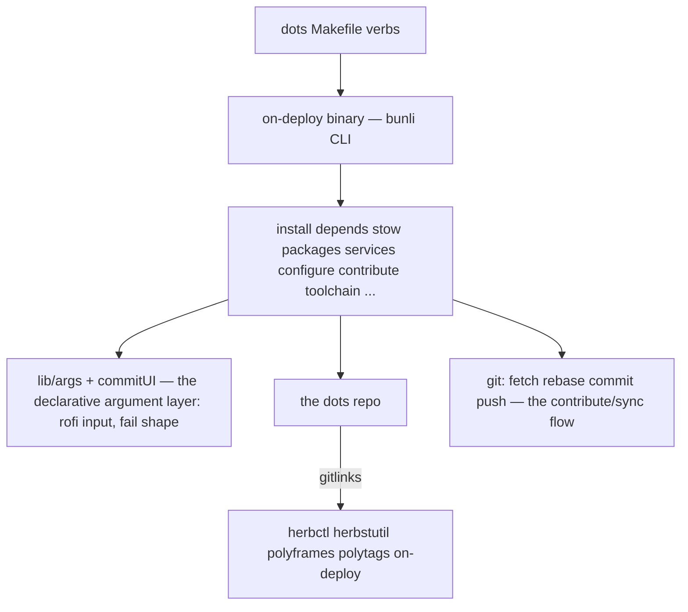
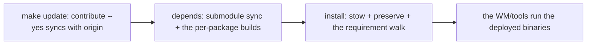

# on-deploy — structural + logical

## structural

```mermaid
graph TD
    MAKE[dots Makefile verbs] --> OD[on-deploy binary — bunli CLI]
    OD --> CMDS[install depends stow packages services configure contribute toolchain ...]
    CMDS --> ARGS[lib/args + commitUI — the declarative argument layer: rofi input, fail shape]
    CMDS --> DOTS[lib/dots — the repo contract: manifests, origin, gitlinks]
    CMDS --> GIT[git: fetch rebase commit push — the contribute/sync flow]
    DOTS[the dots repo] -->|gitlinks| SUB[herbctl herbstutil polyframes polytags on-deploy]
```

## logical

```mermaid
flowchart LR
    A[make update: contribute --yes syncs with origin] --> B[depends: submodule sync + the per-package builds]
    B --> C[install: stow + preserve + the requirement walk]
    C --> D[the WM/tools run the deployed binaries]
```
